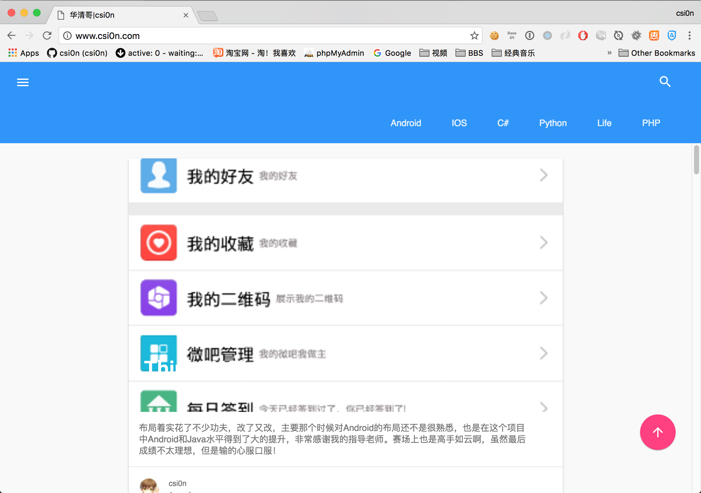
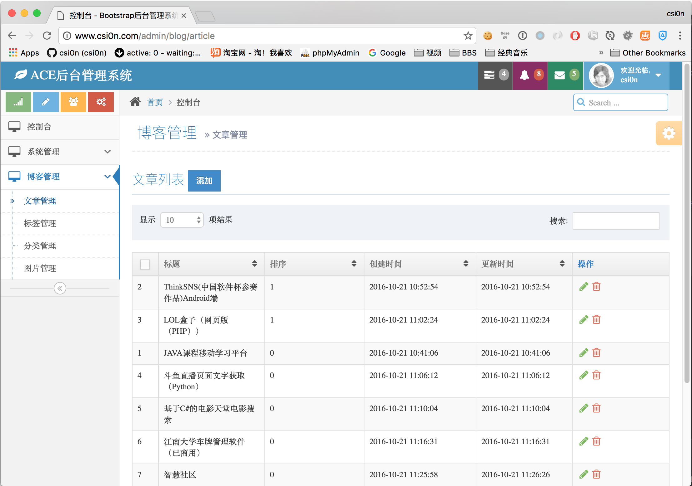
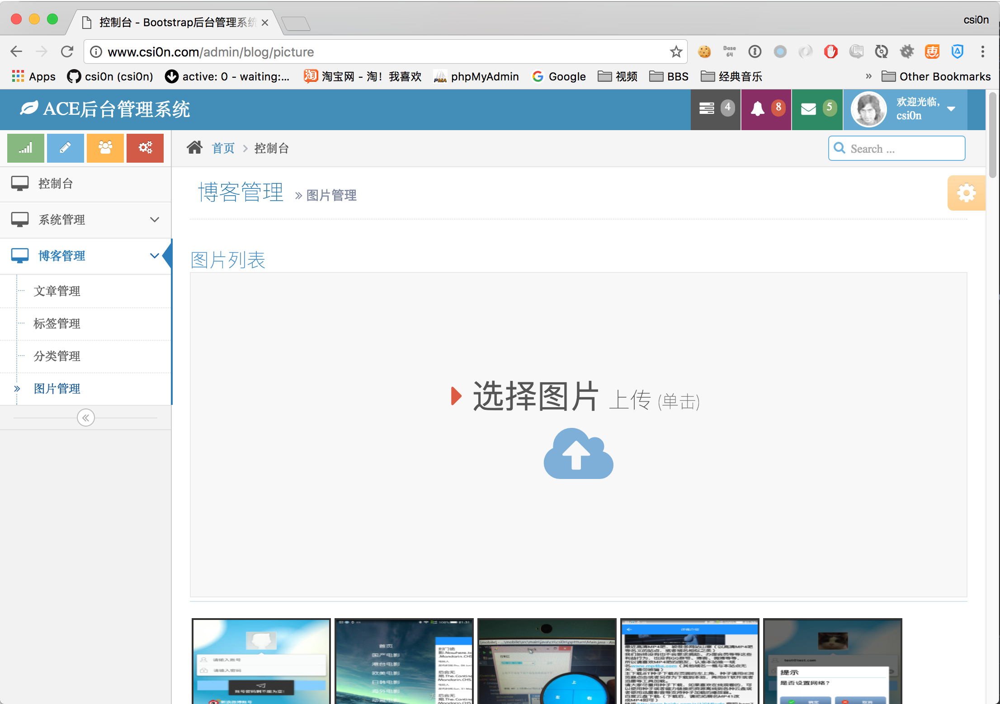

#个人博客
- [我的博客](http://www.csi0n.com)

#开发背景
由于对PHP还不是很熟，所以照着写了一套博客，使用的是material design设计风格，由于目前公司使用的多是laravel框架所以就用laravel写了一个。

#安装
1. 下载本项目,然后在项目根目录执行 `composer install`
2. 包安装完成后,复制.env.example 文件为.env配置好相关的参数
3. 执行 `php artisan key:generate`
4. 执行 `php artisan vendor:publish` 发布配置文件
5. 迁移数据: `php artisan migrate --seed`  
6. 配置一个二级域名指向storage/resource目录下修改config/blog.php文件下的img_prefix为二级域名
7. 修改配置多说配置文件config/duoshuo.php修改short_name和secret为自己申请的
8. 修改routes文件中的host和termsOfService为自己的博客域名

####安装成功后:
- 安装成功后地址为www.example.com
- 后台地址为www.example.com/admin
- Api地址为www.example.com/api/docs

#说明
闲着无聊于是又写了一个自动同步多说评论的小工具可以在多说中设置有评论时自动同步（主要用户Android和IOS版本获得评论，当然方法有很多种，我只是用了一种而已）
```
#同步地址
www.example.com/sync?chq=xxxxxx
#xxxxx为配置在config/blog.php下的sync_pwd参数
```
在多说中可以设置有评论时自动同步一次。

#图片




###其他链接:
- [Android版本](https://github.com/csi0n/Ace-Admin-Blog-Android)
- [IOS版本](https://github.com/csi0n/Ace-Admin-Blog-IOS)
- 后续还会有别的版本RN,Swift,kotlin....敬请期待.

enjoy it :)


